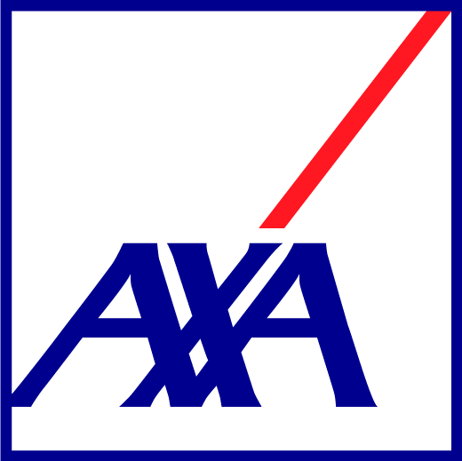

# Simulation to compare weighted (ecological) impact magnitude (omega) of invasive species

InvaPact Workshop 
Vers-Pont-du-Gard, Provence, France 
October 2023 

<a href="https://github.com/cjabradshaw">Corey Bradshaw</a> 
Flinders University 

## Scripts
- <code>InvaPactSim.R</code>: script setting up simulation for 3 regions of set assessment characteristics, and the calculation of omega (weighted impact magnitude), mean omega per invasive species, and InvaPacts (affected species-weighted omega per invasive species)
- <code>InvaPact conf sensitivity.R</code>: script testing changes in the confidence of one region's assessments to determine affect on mean omega differences among regions 
- <code>InvaPact impact sensitivity.R</code>: script testing changes in the impact magnitude of one region's assessments to determine affect on mean omega differences among regions
- <code>InvaPact assessment sensitivity.R</code>: script testing changes in the maximum number of assessments per invasive species in one region to determine affect on mean omega differences among regions 

## Required R libraries
- <code>jtools</code>
- <code>ggplot2</code>
- <code>ggpubr</code>

 &nbsp;  &nbsp; &nbsp;   &nbsp; &nbsp;  &nbsp; &nbsp;  &nbsp; &nbsp; &nbsp; 

